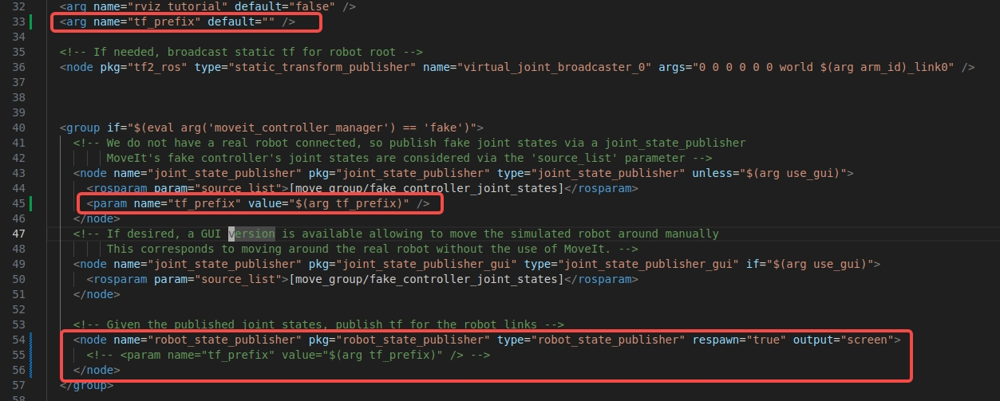

基于isaac sim仿真环境构建机器人叠衣服算法

安装isaac sim 4.5，
参考 https://docs.isaacsim.omniverse.nvidia.com/4.5.0/installation/install_workstation.html

ubuntu20.04上安装ros1 noetic、moveit1
参考 https://docs.ros.org/en/melodic/api/moveit_tutorials/html/doc/getting_started/getting_started.html#install-moveit


建议在isaacsim的安装目录下，下载此项目。
isaacsim/.vscode下包含vscode开发中用到的环境配置，
所以在isaacsim目录下打开vscode程序进行开发。

修改```panda_moveit_config```包里面的```launch/demo.launch```文件中```tf_prefix```


启动franka panda机械臂：
```shell
ROS_NAMESPACE=panda_left roslaunch panda_moveit_config demo.launch rviz_tutorial:=true tf_prefix:=panda_left
ROS_NAMESPACE=panda_right roslaunch panda_moveit_config demo.launch rviz_tutorial:=true tf_prefix:=panda_right
```
在弹出的rviz窗口中点击```Add```按钮，选择```MotionPlanning```

启动isaac sim仿真程序
```
cd isaacsim
./python.sh cloth_folding/isaac_sim/franka_cloth_folding.py
```
或者在vscode中debug启动代码，前提是用的是isaacsim自带的python程序
(```isaacsim/kit/python/bin/python3```)和 ```PYTHONPATH```等环境变量配置正确

启动ROS抓取测试程序，正确运行的话会执行双机械臂抓取衣物的一个效果。
需要确保使用系统自带的python执行程序。
```shell
python ros/franka_pickup.py 
```

启动点云采集程序可以采集isaac sim场景中的点云并存储到```tmp.pcd```文件。
```shell
python ros/rgbd_to_pointcloud.py
pcl_viewer -ax 1.0 tmp.pcd
```

用系统自带的python环境，启动叠衣服数据标注工具
```shell
python ros/annotation_gui.py
```