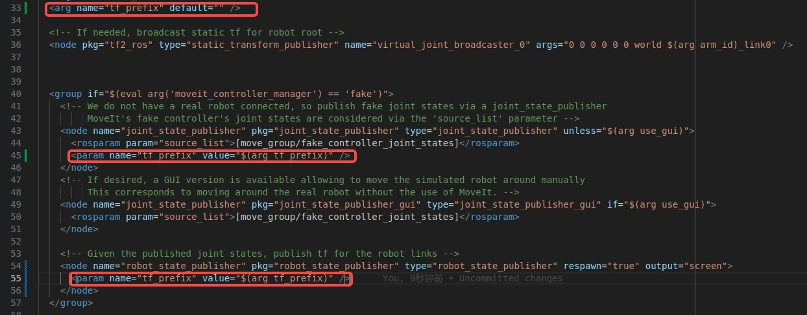

# 基于Isaac sim + ROS1 + MOVEIT + Unity VR 的机械臂叠衣服环境

基于isaac sim仿真环境构建机器人叠衣服算法

安装isaac sim 4.5，
参考 https://docs.isaacsim.omniverse.nvidia.com/4.5.0/installation/install_workstation.html

ubuntu20.04上安装ros1 noetic、moveit1
参考 https://docs.ros.org/en/melodic/api/moveit_tutorials/html/doc/getting_started/getting_started.html#install-moveit


建议在isaacsim的安装目录下，下载此项目。
isaacsim/.vscode下包含vscode开发中用到的环境配置，
所以在isaacsim目录下打开vscode程序进行开发。

修改```panda_moveit_config```包里面的```launch/demo.launch```文件中```tf_prefix```


启动franka panda机械臂：
```shell
ROS_NAMESPACE=panda_left roslaunch panda_moveit_config demo.launch rviz_tutorial:=true tf_prefix:=panda_left
ROS_NAMESPACE=panda_right roslaunch panda_moveit_config demo.launch rviz_tutorial:=true tf_prefix:=panda_right
```
在弹出的rviz窗口中点击```Add```按钮，选择```MotionPlanning```

启动isaac sim仿真程序
```shell
conda activate isaac
python isaac_sim/franka_cloth_folding.py --mode=aloha
```
或者在vscode中debug启动代码，前提是用的是isaacsim自带的python程序
(```isaacsim/kit/python/bin/python3```)和 ```PYTHONPATH```等环境变量配置正确

启动ROS抓取测试程序，正确运行的话会执行双机械臂抓取衣物的一个效果。
需要确保使用系统自带的python执行程序。
```shell
python ros/franka_pickup.py 
```

启动点云采集程序可以采集isaac sim场景中的点云并存储到```tmp.pcd```文件。
```shell
python ros/rgbd_to_pointcloud.py
pcl_viewer -ax 1.0 tmp.pcd
```

用系统自带的python环境，启动叠衣服数据标注工具
```shell
python ros/annotation_gui.py
```

鼠标控制机械臂运动的示例
```shell
python ros/mouse.py
```

VR控制机械臂运动的示例, 需要启动mobile_aloha仿真程序
```shell
# 启动isaac sim仿真程序
conda activate isaac
python isaac_sim/franka_cloth_folding.py --mode=mobile_aloha
# 将msg拷贝到catkin workspace中
# unity与ROS通信，参考： https://github.com/Unity-Technologies/Unity-Robotics-Hub/blob/main/tutorials/ros_unity_integration/publisher.md
cp -r cloth_folding/ros/unity_robotics_demo_msgs ~/ws_moveit/src/
cd ~/ws_moveit
catkin build
source ~/ws_moveit/devel/setup.bash
roslaunch ros_tcp_endpoint endpoint.launch
# 启动VR控制程序
python ros/vr.py
# 需要启动一下节点来推送图片数据到VR中
python ros/transfer_image.py
# Unity端接收数据的功能目前只在PC Unity中工作正常， 在Quest3中不工作， ROS-TCP-Endpoint端会提示：
[WARN] [1752574223.250440]: Inbound TCP/IP connection failed: connection from sender terminated before handshake header received. 0 bytes were received. Please check sender for additional details.ROS-TCP-Endpoint
```
VR设备端的代码在： https://github.com/ronjian/cloth_folding_teleoperation

# 基于Isaac Lab + Vuer的遥操作方案

安装unitree_sim_isaaclab， 参考 https://github.com/unitreerobotics/unitree_sim_isaaclab/tree/1a5d52267577c3223eee2e8d514ff4e9a71e7946?tab=readme-ov-file#22-installation-on-ubuntu-2004

启动：
```shell
conda activate unitree_sim_env
python sim_main.py --device cpu  --enable_cameras  --task  Isaac-PickPlace-Cylinder-G129-Dex1-Joint    --enable_gripper_dds --robot_type g129
```

安装avp_teleoperate， 参考newVuer分支的： https://github.com/unitreerobotics/avp_teleoperate/tree/375cdc27605de377c698e2b89cad0e5885724ca6?tab=readme-ov-file#1--prerequisites
其中创建conda环境的时候，要指定为python=3.10

启动：
```shell
conda activate tv
python teleop_hand_and_arm.py --xr-mode=controller --ee=gripper --sim
```

将quest3与pc机用usb3.0线连接，启动adb的反向端口，参考 https://github.com/unitreerobotics/avp_teleoperate/issues/32#issuecomment-2658084837
```shell
sudo ./adb -s 2G0YC1ZF9J0D9D reverse tcp:8012 tcp:8012
```

进入quest3的浏览器，输入https://localhost:8012/?ws=wss://localhost:8012, 进入VR遥操作